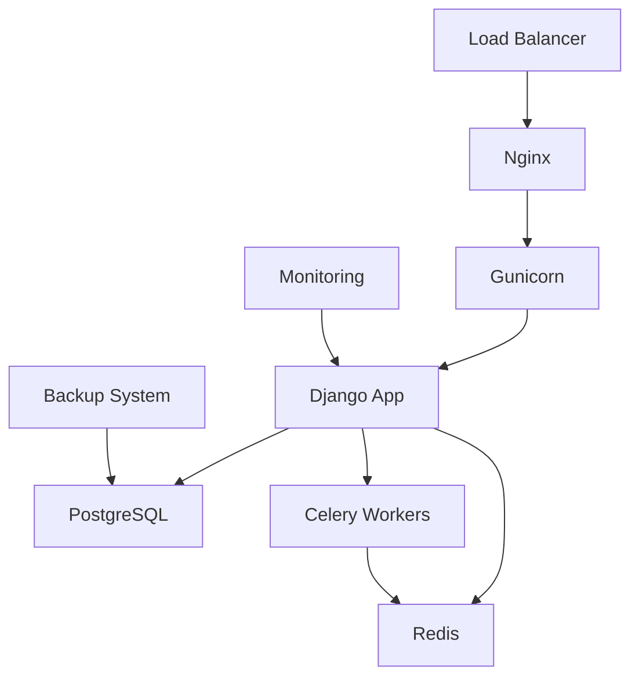

# Review Manager Deployment Guide

**Version:** 1.0.0  
**Target Environments:** Production, Staging, Development  
**Infrastructure:** Django 4.2, PostgreSQL, Redis, Nginx  

## Table of Contents

- [Prerequisites](#prerequisites)
- [Environment Setup](#environment-setup)
- [Database Configuration](#database-configuration)
- [Application Deployment](#application-deployment)
- [Security Configuration](#security-configuration)
- [Performance Optimization](#performance-optimization)
- [Monitoring & Logging](#monitoring--logging)
- [Backup & Recovery](#backup--recovery)
- [Troubleshooting](#troubleshooting)
- [Maintenance](#maintenance)

## Prerequisites

### System Requirements

#### Minimum Requirements
- **CPU**: 2 cores, 2.4GHz
- **RAM**: 4GB
- **Storage**: 50GB SSD
- **Network**: 1Gbps
- **OS**: Ubuntu 20.04 LTS or RHEL 8+

#### Recommended for Production
- **CPU**: 4 cores, 3.0GHz
- **RAM**: 8GB
- **Storage**: 100GB SSD
- **Network**: 1Gbps with redundancy
- **OS**: Ubuntu 22.04 LTS

### Software Dependencies

```bash
# Core requirements
Python 3.9+
PostgreSQL 13+
Redis 6.0+
Nginx 1.18+

# Python packages (see requirements.txt)
Django==4.2.x
psycopg[binary,pool]==3.1.x
redis==4.5.x
celery==5.3.x
gunicorn==21.x
```

### Infrastructure Components



## Environment Setup

### 1. System Preparation

#### Ubuntu/Debian
```bash
# Update system
sudo apt update && sudo apt upgrade -y

# Install system dependencies
sudo apt install -y \
    python3.9 python3.9-venv python3.9-dev \
    postgresql postgresql-contrib libpq-dev \
    redis-server \
    nginx \
    git curl wget \
    supervisor \
    build-essential

# Install Node.js for static assets (optional)
curl -fsSL https://deb.nodesource.com/setup_18.x | sudo -E bash -
sudo apt install -y nodejs
```

#### RHEL/CentOS
```bash
# Update system
sudo dnf update -y

# Install EPEL repository
sudo dnf install -y epel-release

# Install system dependencies
sudo dnf install -y \
    python39 python39-devel \
    postgresql13-server postgresql13-contrib postgresql13-devel \
    redis \
    nginx \
    git curl wget \
    supervisor \
    gcc gcc-c++ make
```

### 2. User Setup

```bash
# Create application user
sudo useradd -m -s /bin/bash thesis-grey
sudo usermod -aG sudo thesis-grey

# Create application directory
sudo mkdir -p /opt/thesis-grey
sudo chown thesis-grey:thesis-grey /opt/thesis-grey

# Switch to application user
sudo su - thesis-grey
```

### 3. Python Environment

```bash
# Create virtual environment
cd /opt/thesis-grey
python3.9 -m venv venv
source venv/bin/activate

# Upgrade pip
pip install --upgrade pip setuptools wheel

# Install application dependencies
pip install -r requirements.txt

# Install additional production dependencies
pip install gunicorn psycopg[binary,pool] redis celery supervisor
```

## Database Configuration

### 1. PostgreSQL Setup

#### Installation & Configuration
```bash
# Initialize database (RHEL/CentOS only)
sudo postgresql-setup --initdb

# Start and enable PostgreSQL
sudo systemctl start postgresql
sudo systemctl enable postgresql

# Access PostgreSQL
sudo -u postgres psql
```

#### Database Creation
```sql
-- Create database and user
CREATE DATABASE thesis_grey_db;
CREATE USER thesis_grey_user WITH ENCRYPTED PASSWORD 'your_secure_password';

-- Grant privileges
GRANT ALL PRIVILEGES ON DATABASE thesis_grey_db TO thesis_grey_user;
ALTER USER thesis_grey_user CREATEDB;  -- For running tests

-- Optimize for application
ALTER DATABASE thesis_grey_db SET timezone TO 'UTC';
ALTER DATABASE thesis_grey_db SET default_transaction_isolation TO 'read committed';
ALTER DATABASE thesis_grey_db SET client_encoding TO 'utf8';

\q
```

#### PostgreSQL Configuration (`/etc/postgresql/*/main/postgresql.conf`)
```ini
# Connection settings
listen_addresses = 'localhost'
port = 5432
max_connections = 100

# Memory settings
shared_buffers = 256MB
effective_cache_size = 1GB
work_mem = 4MB
maintenance_work_mem = 64MB

# Write ahead logging
wal_level = replica
max_wal_size = 1GB
min_wal_size = 80MB

# Query planning
random_page_cost = 1.1  # For SSD storage
effective_io_concurrency = 200

# Logging
log_destination = 'stderr'
logging_collector = on
log_directory = 'log'
log_filename = 'postgresql-%Y-%m-%d_%H%M%S.log'
log_min_duration_statement = 1000  # Log slow queries
```

#### pg_hba.conf Configuration
```ini
# Local connections
local   all             postgres                                peer
local   all             all                                     peer

# IPv4 local connections
host    all             all             127.0.0.1/32            md5
host    thesis_grey_db  thesis_grey_user 127.0.0.1/32          md5

# IPv6 local connections  
host    all             all             ::1/128                 md5
```

### 2. Redis Setup

#### Configuration (`/etc/redis/redis.conf`)
```ini
# Network
bind 127.0.0.1
port 6379
protected-mode yes

# Memory management
maxmemory 512mb
maxmemory-policy allkeys-lru

# Persistence
save 900 1
save 300 10
save 60 10000

# Security
requirepass your_redis_password

# Logging
loglevel notice
logfile /var/log/redis/redis-server.log

# Performance
tcp-keepalive 300
timeout 0
```

#### Start Redis
```bash
sudo systemctl start redis-server
sudo systemctl enable redis-server

# Test connection
redis-cli -a your_redis_password ping
```

## Application Deployment

### 1. Code Deployment

```bash
# Clone repository
cd /opt/thesis-grey
git clone https://github.com/your-org/thesis-grey-literature.git app
cd app

# Activate virtual environment
source ../venv/bin/activate

# Install dependencies
pip install -r requirements.txt
```

### 2. Django Configuration

#### Production Settings (`thesis_grey_project/settings/production.py`)
```python
from .base import *
import os

# Security settings
DEBUG = False
ALLOWED_HOSTS = ['your-domain.com', 'www.your-domain.com']

# Database configuration
DATABASES = {
    'default': {
        'ENGINE': 'django.db.backends.postgresql',
        'NAME': 'thesis_grey_db',
        'USER': 'thesis_grey_user',
        'PASSWORD': os.environ.get('DB_PASSWORD'),
        'HOST': 'localhost',
        'PORT': '5432',
        'OPTIONS': {
            'connect_timeout': 10,
        },
        'CONN_MAX_AGE': 600,
    }
}

# Cache configuration
CACHES = {
    'default': {
        'BACKEND': 'django.core.cache.backends.redis.RedisCache',
        'LOCATION': f'redis://:{os.environ.get("REDIS_PASSWORD")}@localhost:6379/1',
        'OPTIONS': {
            'CLIENT_CLASS': 'django_redis.client.DefaultClient',
        },
        'KEY_PREFIX': 'thesis_grey',
        'TIMEOUT': 300,
    }
}

# Session configuration
SESSION_ENGINE = 'django.contrib.sessions.backends.cache'
SESSION_CACHE_ALIAS = 'default'
SESSION_COOKIE_AGE = 3600  # 1 hour
SESSION_COOKIE_SECURE = True
SESSION_COOKIE_HTTPONLY = True
SESSION_COOKIE_SAMESITE = 'Lax'

# CSRF protection
CSRF_COOKIE_SECURE = True
CSRF_COOKIE_HTTPONLY = True
CSRF_TRUSTED_ORIGINS = ['https://your-domain.com']

# Security headers
SECURE_SSL_REDIRECT = True
SECURE_HSTS_SECONDS = 31536000
SECURE_HSTS_INCLUDE_SUBDOMAINS = True
SECURE_HSTS_PRELOAD = True
SECURE_CONTENT_TYPE_NOSNIFF = True
SECURE_BROWSER_XSS_FILTER = True

# Static files
STATIC_URL = '/static/'
STATIC_ROOT = '/opt/thesis-grey/static'
MEDIA_URL = '/media/'
MEDIA_ROOT = '/opt/thesis-grey/media'

# Email configuration (for notifications)
EMAIL_BACKEND = 'django.core.mail.backends.smtp.EmailBackend'
EMAIL_HOST = os.environ.get('EMAIL_HOST', 'localhost')
EMAIL_PORT = int(os.environ.get('EMAIL_PORT', 587))
EMAIL_USE_TLS = True
EMAIL_HOST_USER = os.environ.get('EMAIL_USER')
EMAIL_HOST_PASSWORD = os.environ.get('EMAIL_PASSWORD')
DEFAULT_FROM_EMAIL = 'noreply@your-domain.com'

# Celery configuration
CELERY_BROKER_URL = f'redis://:{os.environ.get("REDIS_PASSWORD")}@localhost:6379/2'
CELERY_RESULT_BACKEND = f'redis://:{os.environ.get("REDIS_PASSWORD")}@localhost:6379/3'
CELERY_ACCEPT_CONTENT = ['json']
CELERY_TASK_SERIALIZER = 'json'
CELERY_RESULT_SERIALIZER = 'json'
CELERY_TIMEZONE = 'UTC'

# Logging configuration
LOGGING = {
    'version': 1,
    'disable_existing_loggers': False,
    'formatters': {
        'verbose': {
            'format': '{levelname} {asctime} {module} {process:d} {thread:d} {message}',
            'style': '{',
        },
        'simple': {
            'format': '{levelname} {message}',
            'style': '{',
        },
    },
    'handlers': {
        'file': {
            'level': 'INFO',
            'class': 'logging.handlers.RotatingFileHandler',
            'filename': '/var/log/thesis-grey/django.log',
            'maxBytes': 10485760,  # 10MB
            'backupCount': 5,
            'formatter': 'verbose',
        },
        'security': {
            'level': 'WARNING',
            'class': 'logging.handlers.RotatingFileHandler',
            'filename': '/var/log/thesis-grey/security.log',
            'maxBytes': 10485760,
            'backupCount': 10,
            'formatter': 'verbose',
        },
    },
    'loggers': {
        'django': {
            'handlers': ['file'],
            'level': 'INFO',
            'propagate': True,
        },
        'apps.review_manager': {
            'handlers': ['file'],
            'level': 'INFO',
            'propagate': True,
        },
        'django.security': {
            'handlers': ['security'],
            'level': 'WARNING',
            'propagate': False,
        },
    },
}

# Review Manager specific settings
REVIEW_MANAGER_SETTINGS = {
    'MAX_SESSIONS_PER_USER': 100,
    'AUTO_ARCHIVE_DAYS': 365,
    'ACTIVITY_RETENTION_DAYS': 1095,
    'RATE_LIMIT_REQUESTS': 60,
    'RATE_LIMIT_WINDOW': 3600,
}
```

#### Environment Variables (`.env`)
```bash
# Database
DB_PASSWORD=your_secure_db_password

# Redis
REDIS_PASSWORD=your_redis_password

# Django
SECRET_KEY=your_very_long_secret_key_here
DJANGO_SETTINGS_MODULE=thesis_grey_project.settings.production

# Email
EMAIL_HOST=smtp.your-provider.com
EMAIL_PORT=587
EMAIL_USER=your-email@your-domain.com
EMAIL_PASSWORD=your_email_password

# External APIs (future use)
SEARCH_API_KEY=your_search_api_key
```

### 3. Database Migration

```bash
# Apply migrations
python manage.py migrate

# Create superuser
python manage.py createsuperuser

# Collect static files
python manage.py collectstatic --noinput

# Load initial data (optional)
python manage.py loaddata fixtures/initial_data.json
```

### 4. Gunicorn Configuration

#### Gunicorn Configuration (`/opt/thesis-grey/gunicorn.conf.py`)
```python
import multiprocessing

# Server socket
bind = "unix:/opt/thesis-grey/gunicorn.sock"
backlog = 2048

# Worker processes
workers = multiprocessing.cpu_count() * 2 + 1
worker_class = "sync"
worker_connections = 1000
timeout = 30
keepalive = 2

# Restart workers after this many requests
max_requests = 1000
max_requests_jitter = 50

# Application
wsgi_module = "thesis_grey_project.wsgi:application"
pythonpath = "/opt/thesis-grey/app"

# Logging
accesslog = "/var/log/thesis-grey/gunicorn-access.log"
errorlog = "/var/log/thesis-grey/gunicorn-error.log"
loglevel = "info"
access_log_format = '%(h)s %(l)s %(u)s %(t)s "%(r)s" %(s)s %(b)s "%(f)s" "%(a)s"'

# Process naming
proc_name = "thesis-grey"

# Server mechanics
preload_app = True
daemon = False
pidfile = "/opt/thesis-grey/gunicorn.pid"
user = "thesis-grey"
group = "thesis-grey"
tmp_upload_dir = None

# SSL (if terminating SSL at Gunicorn)
# keyfile = "/path/to/keyfile"
# certfile = "/path/to/certfile"
```

#### Systemd Service (`/etc/systemd/system/thesis-grey.service`)
```ini
[Unit]
Description=Thesis Grey Literature Gunicorn Application Server
Requires=thesis-grey.socket
After=network.target

[Service]
Type=notify
User=thesis-grey
Group=thesis-grey
RuntimeDirectory=thesis-grey
WorkingDirectory=/opt/thesis-grey/app
Environment=PATH=/opt/thesis-grey/venv/bin
Environment=DJANGO_SETTINGS_MODULE=thesis_grey_project.settings.production
EnvironmentFile=/opt/thesis-grey/.env
ExecStart=/opt/thesis-grey/venv/bin/gunicorn \
    --config /opt/thesis-grey/gunicorn.conf.py \
    thesis_grey_project.wsgi:application
ExecReload=/bin/kill -s HUP $MAINPID
ExecStop=/bin/kill -s TERM $MAINPID
Restart=always
RestartSec=10

[Install]
WantedBy=multi-user.target
```

#### Socket Configuration (`/etc/systemd/system/thesis-grey.socket`)
```ini
[Unit]
Description=Thesis Grey Literature Gunicorn Socket

[Socket]
ListenStream=/opt/thesis-grey/gunicorn.sock
SocketUser=www-data
SocketGroup=www-data
SocketMode=0660

[Install]
WantedBy=sockets.target
```

### 5. Celery Configuration

#### Celery Service (`/etc/systemd/system/thesis-grey-celery.service`)
```ini
[Unit]
Description=Thesis Grey Literature Celery Worker
After=network.target redis.service postgresql.service

[Service]
Type=simple
User=thesis-grey
Group=thesis-grey
WorkingDirectory=/opt/thesis-grey/app
Environment=PATH=/opt/thesis-grey/venv/bin
Environment=DJANGO_SETTINGS_MODULE=thesis_grey_project.settings.production
EnvironmentFile=/opt/thesis-grey/.env
ExecStart=/opt/thesis-grey/venv/bin/celery -A thesis_grey_project worker \
    --loglevel=info \
    --logfile=/var/log/thesis-grey/celery-worker.log \
    --pidfile=/opt/thesis-grey/celery-worker.pid
ExecStop=/bin/kill -s TERM $MAINPID
Restart=always
RestartSec=10

[Install]
WantedBy=multi-user.target
```

#### Celery Beat Service (`/etc/systemd/system/thesis-grey-celery-beat.service`)
```ini
[Unit]
Description=Thesis Grey Literature Celery Beat Scheduler
After=network.target redis.service

[Service]
Type=simple
User=thesis-grey
Group=thesis-grey
WorkingDirectory=/opt/thesis-grey/app
Environment=PATH=/opt/thesis-grey/venv/bin
Environment=DJANGO_SETTINGS_MODULE=thesis_grey_project.settings.production
EnvironmentFile=/opt/thesis-grey/.env
ExecStart=/opt/thesis-grey/venv/bin/celery -A thesis_grey_project beat \
    --loglevel=info \
    --logfile=/var/log/thesis-grey/celery-beat.log \
    --pidfile=/opt/thesis-grey/celery-beat.pid \
    --schedule=/opt/thesis-grey/celerybeat-schedule
Restart=always
RestartSec=10

[Install]
WantedBy=multi-user.target
```

### 6. Nginx Configuration

#### Main Configuration (`/etc/nginx/sites-available/thesis-grey`)
```nginx
upstream thesis_grey_app {
    server unix:/opt/thesis-grey/gunicorn.sock fail_timeout=0;
}

# Redirect HTTP to HTTPS
server {
    listen 80;
    server_name your-domain.com www.your-domain.com;
    return 301 https://$server_name$request_uri;
}

# Main HTTPS server
server {
    listen 443 ssl http2;
    server_name your-domain.com www.your-domain.com;
    
    # SSL configuration
    ssl_certificate /path/to/ssl/certificate.crt;
    ssl_certificate_key /path/to/ssl/private.key;
    ssl_protocols TLSv1.2 TLSv1.3;
    ssl_ciphers ECDHE-RSA-AES256-GCM-SHA512:DHE-RSA-AES256-GCM-SHA512:ECDHE-RSA-AES256-GCM-SHA384:DHE-RSA-AES256-GCM-SHA384;
    ssl_prefer_server_ciphers off;
    ssl_session_cache shared:SSL:10m;
    ssl_session_timeout 10m;
    
    # Security headers
    add_header Strict-Transport-Security "max-age=31536000; includeSubDomains; preload" always;
    add_header X-Content-Type-Options nosniff always;
    add_header X-Frame-Options DENY always;
    add_header X-XSS-Protection "1; mode=block" always;
    add_header Referrer-Policy "strict-origin-when-cross-origin" always;
    add_header Content-Security-Policy "default-src 'self'; script-src 'self' 'unsafe-inline'; style-src 'self' 'unsafe-inline'; img-src 'self' data:; font-src 'self';" always;
    
    # Logging
    access_log /var/log/nginx/thesis-grey-access.log;
    error_log /var/log/nginx/thesis-grey-error.log;
    
    # General configuration
    client_max_body_size 10M;
    keepalive_timeout 65;
    
    # Gzip compression
    gzip on;
    gzip_vary on;
    gzip_min_length 1024;
    gzip_types text/plain text/css text/xml text/javascript 
               application/javascript application/xml+rss 
               application/json application/xml;
    
    # Static files
    location /static/ {
        alias /opt/thesis-grey/static/;
        expires 1y;
        add_header Cache-Control "public, immutable";
        access_log off;
    }
    
    # Media files
    location /media/ {
        alias /opt/thesis-grey/media/;
        expires 1m;
        add_header Cache-Control "public";
    }
    
    # Application
    location / {
        proxy_pass http://thesis_grey_app;
        proxy_set_header Host $host;
        proxy_set_header X-Real-IP $remote_addr;
        proxy_set_header X-Forwarded-For $proxy_add_x_forwarded_for;
        proxy_set_header X-Forwarded-Proto $scheme;
        proxy_redirect off;
        
        # Timeouts
        proxy_connect_timeout 30s;
        proxy_send_timeout 30s;
        proxy_read_timeout 30s;
        
        # Buffer settings
        proxy_buffering on;
        proxy_buffer_size 4k;
        proxy_buffers 8 4k;
    }
    
    # Health check endpoint
    location /health/ {
        proxy_pass http://thesis_grey_app;
        access_log off;
    }
    
    # Deny access to sensitive files
    location ~ /\. {
        deny all;
        access_log off;
        log_not_found off;
    }
    
    location ~ ~$ {
        deny all;
        access_log off;
        log_not_found off;
    }
}
```

#### Enable Site
```bash
# Enable site
sudo ln -s /etc/nginx/sites-available/thesis-grey /etc/nginx/sites-enabled/

# Test configuration
sudo nginx -t

# Reload nginx
sudo systemctl reload nginx
```

## Security Configuration

### 1. Firewall Setup

```bash
# Install UFW (Ubuntu) or use firewalld (RHEL)
sudo apt install ufw

# Default policies
sudo ufw default deny incoming
sudo ufw default allow outgoing

# SSH access
sudo ufw allow ssh

# HTTP and HTTPS
sudo ufw allow 80/tcp
sudo ufw allow 443/tcp

# Enable firewall
sudo ufw enable

# Check status
sudo ufw status verbose
```

### 2. SSL/TLS Configuration

#### Let's Encrypt (Recommended)
```bash
# Install Certbot
sudo apt install certbot python3-certbot-nginx

# Obtain certificate
sudo certbot --nginx -d your-domain.com -d www.your-domain.com

# Test auto-renewal
sudo certbot renew --dry-run

# Set up auto-renewal cron job
echo "0 12 * * * /usr/bin/certbot renew --quiet" | sudo tee -a /etc/crontab
```

### 3. Application Security

#### File Permissions
```bash
# Set correct ownership
sudo chown -R thesis-grey:thesis-grey /opt/thesis-grey

# Set file permissions
find /opt/thesis-grey -type f -exec chmod 644 {} \;
find /opt/thesis-grey -type d -exec chmod 755 {} \;

# Executable files
chmod +x /opt/thesis-grey/app/manage.py

# Sensitive files
chmod 600 /opt/thesis-grey/.env
chmod 600 /opt/thesis-grey/app/thesis_grey_project/settings/production.py
```

#### Log Directory Setup
```bash
# Create log directories
sudo mkdir -p /var/log/thesis-grey
sudo chown thesis-grey:thesis-grey /var/log/thesis-grey
sudo chmod 755 /var/log/thesis-grey

# Set up log rotation
sudo tee /etc/logrotate.d/thesis-grey << EOF
/var/log/thesis-grey/*.log {
    daily
    missingok
    rotate 52
    compress
    delaycompress
    notifempty
    create 644 thesis-grey thesis-grey
    postrotate
        systemctl reload thesis-grey
    endscript
}
EOF
```

## Performance Optimization

### 1. Database Optimization

#### Connection Pooling
```python
# In production.py
DATABASES = {
    'default': {
        # ... other settings
        'OPTIONS': {
            'MAX_CONNS': 20,
            'MIN_CONNS': 5,
            'connect_timeout': 10,
        },
        'CONN_MAX_AGE': 600,
    }
}
```

#### Database Maintenance
```bash
# Create maintenance script
sudo tee /opt/thesis-grey/db_maintenance.sh << 'EOF'
#!/bin/bash
# Database maintenance script

# Vacuum and analyze
sudo -u postgres psql -d thesis_grey_db -c "VACUUM ANALYZE;"

# Update table statistics
sudo -u postgres psql -d thesis_grey_db -c "ANALYZE;"

# Reindex if needed (monthly)
if [ $(date +%d) -eq 01 ]; then
    sudo -u postgres psql -d thesis_grey_db -c "REINDEX DATABASE thesis_grey_db;"
fi
EOF

chmod +x /opt/thesis-grey/db_maintenance.sh

# Add to cron (weekly)
echo "0 2 * * 0 /opt/thesis-grey/db_maintenance.sh" | sudo tee -a /etc/crontab
```

### 2. Caching Strategy

#### Redis Optimization
```ini
# /etc/redis/redis.conf additions
# Memory optimization
hash-max-ziplist-entries 512
hash-max-ziplist-value 64
list-max-ziplist-size -2
set-max-intset-entries 512
zset-max-ziplist-entries 128
zset-max-ziplist-value 64

# Background saving
stop-writes-on-bgsave-error yes
rdbcompression yes
rdbchecksum yes
```

#### Application Caching
```python
# Template fragment caching


    <!-- Expensive dashboard content -->


# View caching
from django.views.decorators.cache import cache_page

@cache_page(60 * 5)  # 5 minutes
def expensive_view(request):
    # Expensive operations
    pass
```

### 3. Static File Optimization

```bash
# Install and configure compression
sudo apt install brotli

# Create compressed versions
find /opt/thesis-grey/static -name "*.css" -exec brotli {} \;
find /opt/thesis-grey/static -name "*.js" -exec brotli {} \;

# Update nginx configuration for brotli
# Add to server block:
# brotli on;
# brotli_types text/css application/javascript text/javascript;
```

## Monitoring & Logging

### 1. System Monitoring

#### Install Prometheus + Grafana (Optional)
```bash
# Install Prometheus
wget https://github.com/prometheus/prometheus/releases/download/v2.40.0/prometheus-2.40.0.linux-amd64.tar.gz
tar xvf prometheus-2.40.0.linux-amd64.tar.gz
sudo mv prometheus-2.40.0.linux-amd64 /opt/prometheus

# Install Node Exporter
wget https://github.com/prometheus/node_exporter/releases/download/v1.4.0/node_exporter-1.4.0.linux-amd64.tar.gz
tar xvf node_exporter-1.4.0.linux-amd64.tar.gz
sudo mv node_exporter-1.4.0.linux-amd64 /opt/node_exporter
```

#### Basic Health Monitoring
```bash
# Create health check script
sudo tee /opt/thesis-grey/health_check.sh << 'EOF'
#!/bin/bash
# Health check script

# Check application
curl -f http://localhost/health/ || echo "App health check failed"

# Check database
sudo -u postgres psql -d thesis_grey_db -c "SELECT 1;" || echo "Database check failed"

# Check Redis
redis-cli -a $REDIS_PASSWORD ping || echo "Redis check failed"

# Check disk space
df -h | awk '$5 > 80 {print "Disk usage high: " $0}'

# Check memory
free -m | awk 'NR==2{printf "Memory usage: %.2f%%\n", $3*100/$2}'
EOF

chmod +x /opt/thesis-grey/health_check.sh

# Run every 5 minutes
echo "*/5 * * * * /opt/thesis-grey/health_check.sh" | sudo tee -a /etc/crontab
```

### 2. Application Monitoring

#### Django Health Check
```python
# Add to urls.py
from django.http import JsonResponse
from django.db import connection
from django.core.cache import cache
import redis

def health_check(request):
    """Simple health check endpoint."""
    status = {
        'status': 'healthy',
        'timestamp': timezone.now().isoformat(),
    }
    
    try:
        # Check database
        with connection.cursor() as cursor:
            cursor.execute("SELECT 1")
        status['database'] = 'connected'
    except Exception as e:
        status['database'] = f'error: {str(e)}'
        status['status'] = 'unhealthy'
    
    try:
        # Check cache/Redis
        cache.set('health_check', 'ok', 60)
        cache.get('health_check')
        status['cache'] = 'connected'
    except Exception as e:
        status['cache'] = f'error: {str(e)}'
        status['status'] = 'unhealthy'
    
    return JsonResponse(status)
```

### 3. Log Management

#### Centralized Logging (Optional)
```bash
# Install rsyslog for centralized logging
sudo apt install rsyslog

# Configure application to send logs to syslog
# Add to Django logging configuration:
# 'syslog': {
#     'level': 'INFO',
#     'class': 'logging.handlers.SysLogHandler',
#     'facility': 'local0',
#     'address': '/dev/log',
# }
```

## Backup & Recovery

### 1. Database Backup

```bash
# Create backup script
sudo tee /opt/thesis-grey/backup_db.sh << 'EOF'
#!/bin/bash
# Database backup script

BACKUP_DIR="/opt/thesis-grey/backups/db"
DATE=$(date +%Y%m%d_%H%M%S)
BACKUP_FILE="thesis_grey_db_${DATE}.sql.gz"

# Create backup directory
mkdir -p $BACKUP_DIR

# Create backup
sudo -u postgres pg_dump -h localhost -U thesis_grey_user thesis_grey_db | gzip > $BACKUP_DIR/$BACKUP_FILE

# Keep only last 30 days of backups
find $BACKUP_DIR -name "thesis_grey_db_*.sql.gz" -mtime +30 -delete

# Upload to S3 (optional)
# aws s3 cp $BACKUP_DIR/$BACKUP_FILE s3://your-backup-bucket/db-backups/
EOF

chmod +x /opt/thesis-grey/backup_db.sh

# Schedule daily backups at 2 AM
echo "0 2 * * * /opt/thesis-grey/backup_db.sh" | sudo tee -a /etc/crontab
```

### 2. Application Backup

```bash
# Create application backup script
sudo tee /opt/thesis-grey/backup_app.sh << 'EOF'
#!/bin/bash
# Application backup script

BACKUP_DIR="/opt/thesis-grey/backups/app"
DATE=$(date +%Y%m%d_%H%M%S)
BACKUP_FILE="thesis_grey_app_${DATE}.tar.gz"

# Create backup directory
mkdir -p $BACKUP_DIR

# Create backup (exclude venv and __pycache__)
tar -czf $BACKUP_DIR/$BACKUP_FILE \
    --exclude='venv' \
    --exclude='__pycache__' \
    --exclude='*.pyc' \
    --exclude='node_modules' \
    /opt/thesis-grey/app

# Keep only last 7 days of app backups
find $BACKUP_DIR -name "thesis_grey_app_*.tar.gz" -mtime +7 -delete
EOF

chmod +x /opt/thesis-grey/backup_app.sh

# Schedule weekly backups
echo "0 3 * * 0 /opt/thesis-grey/backup_app.sh" | sudo tee -a /etc/crontab
```

### 3. Recovery Procedures

#### Database Recovery
```bash
# Stop application
sudo systemctl stop thesis-grey thesis-grey-celery thesis-grey-celery-beat

# Restore database
gunzip -c /opt/thesis-grey/backups/db/thesis_grey_db_YYYYMMDD_HHMMSS.sql.gz | \
    sudo -u postgres psql -h localhost -U thesis_grey_user thesis_grey_db

# Start application
sudo systemctl start thesis-grey thesis-grey-celery thesis-grey-celery-beat
```

#### Application Recovery
```bash
# Extract backup
tar -xzf /opt/thesis-grey/backups/app/thesis_grey_app_YYYYMMDD_HHMMSS.tar.gz -C /

# Restore file permissions
sudo chown -R thesis-grey:thesis-grey /opt/thesis-grey
find /opt/thesis-grey -type f -exec chmod 644 {} \;
find /opt/thesis-grey -type d -exec chmod 755 {} \;

# Restart services
sudo systemctl restart thesis-grey thesis-grey-celery thesis-grey-celery-beat
```

## Troubleshooting

### Common Issues

#### Application Won't Start
```bash
# Check systemd service status
sudo systemctl status thesis-grey

# Check logs
sudo journalctl -u thesis-grey -f

# Check Gunicorn logs
tail -f /var/log/thesis-grey/gunicorn-error.log

# Check application logs
tail -f /var/log/thesis-grey/django.log
```

#### Database Connection Issues
```bash
# Test database connection
sudo -u postgres psql -h localhost -U thesis_grey_user thesis_grey_db

# Check PostgreSQL status
sudo systemctl status postgresql

# Check PostgreSQL logs
sudo tail -f /var/log/postgresql/postgresql-*.log
```

#### Redis Connection Issues
```bash
# Test Redis connection
redis-cli -a your_redis_password ping

# Check Redis status
sudo systemctl status redis-server

# Check Redis logs
sudo tail -f /var/log/redis/redis-server.log
```

#### Performance Issues
```bash
# Check system resources
htop
iotop
netstat -tuln

# Check database performance
sudo -u postgres psql -d thesis_grey_db -c "
SELECT query, calls, total_time, mean_time 
FROM pg_stat_statements 
ORDER BY total_time DESC 
LIMIT 10;"

# Check slow queries
grep "slow query" /var/log/thesis-grey/django.log
```

### Emergency Procedures

#### Quick Restart
```bash
# Restart all services
sudo systemctl restart thesis-grey thesis-grey-celery thesis-grey-celery-beat nginx postgresql redis-server
```

#### Rollback Deployment
```bash
# Switch to previous version
cd /opt/thesis-grey/app
git checkout previous-stable-tag

# Restart application
sudo systemctl restart thesis-grey

# If database changes, restore from backup
# (See recovery procedures above)
```

## Maintenance

### Regular Maintenance Tasks

#### Daily
- Monitor application health
- Check log files for errors
- Verify backup completion

#### Weekly
- Update system packages
- Clean up old log files
- Review security alerts

#### Monthly
- Update application dependencies
- Optimize database
- Review performance metrics
- Test backup recovery

### Update Procedures

#### Security Updates
```bash
# System updates
sudo apt update && sudo apt upgrade -y

# Python package updates
source /opt/thesis-grey/venv/bin/activate
pip list --outdated
pip install --upgrade package-name

# Restart services after updates
sudo systemctl restart thesis-grey thesis-grey-celery thesis-grey-celery-beat
```

#### Application Updates
```bash
# Backup before update
/opt/thesis-grey/backup_db.sh
/opt/thesis-grey/backup_app.sh

# Update code
cd /opt/thesis-grey/app
git pull origin main

# Update dependencies
source ../venv/bin/activate
pip install -r requirements.txt

# Run migrations
python manage.py migrate

# Collect static files
python manage.py collectstatic --noinput

# Restart services
sudo systemctl restart thesis-grey thesis-grey-celery thesis-grey-celery-beat
```

---

**Deployment Guide Version:** 1.0.0  
**Last Updated:** 2025-05-30  
**Environment:** Production Ready  
**Status:** ✅ Complete